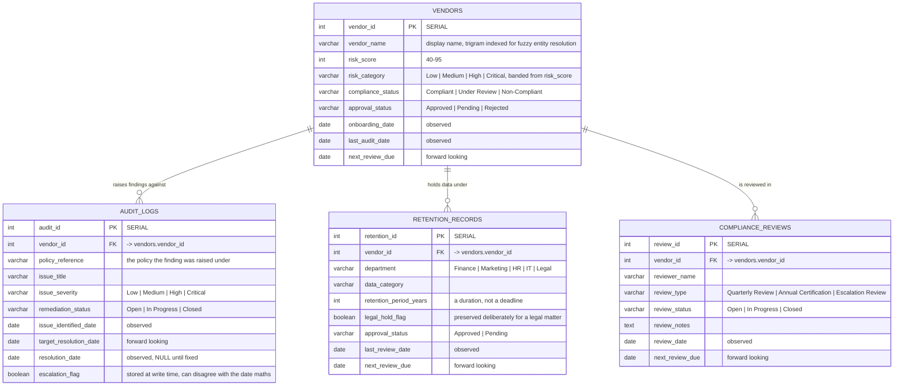
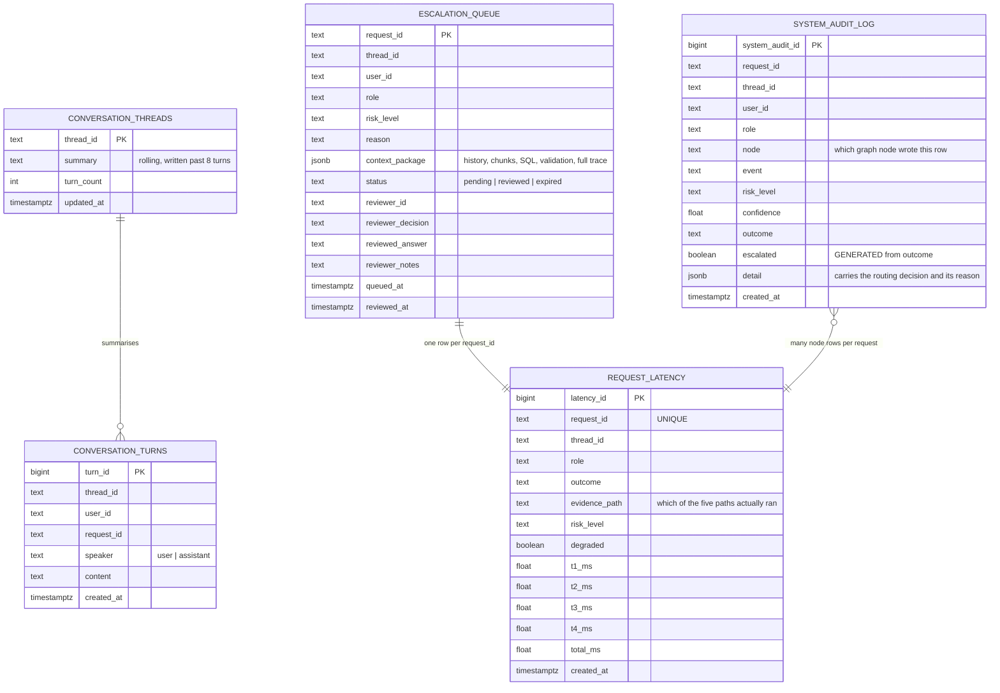

# Entity Relationship Diagram

Retail Policy Intelligence — `retail_compliance_db`.

Two groups of tables live in one database and they are not the same kind of thing.

**Business tables** hold the operational records a compliance question is asked about. They are the
only tables the NL2SQL path reads, and every one of the 17 vetted templates draws from this group.
They are read-only to the application: the connection the SQL path uses is opened read-only, and no
code path writes to them.

**System tables** hold what the system did while answering. They are written by the graph and read
by the review console and the SLO endpoint. No vetted template touches them, so a compliance
question can never accidentally report on the system's own audit trail.

---

## Business tables

`vendors` is the hub. Every other business table hangs off it by `vendor_id`, which is why entity
resolution resolves a vendor name to a numeric id before the SQL path runs: a template that takes a
`vendor_id` gets it from entity resolution, never from the model.

### Observed dates versus forward-looking dates

The distinction in the "observed" and "forward looking" notes above is enforced in code, in
`src/sqlpath/disclosure.py::OBSERVED_DATE_COLUMNS`.

An **observed** date records something that already happened. A value after the pinned as-of date is
impossible, so it is a data defect and the answer is not released on it.

A **forward-looking** date records something scheduled. A value after the as-of date is the normal
case — an open finding due next quarter, a review scheduled for next year. Flagging those was a bug:
every open finding with a future target date used to mint a blocking defect, which is one of the
reasons a correct SQL result never reached the user.

---

## System tables

`system_audit_log` is append-only by rule, not by convention: `CREATE RULE ... DO INSTEAD NOTHING`
blocks UPDATE and DELETE at the database, so the trail survives a mistake in application code.

---

## Which table each evidence path is allowed to read

| Path | Business tables | Policy corpus | Notes |
|---|---|---|---|
| `rag` | none | yes | the database holds no policy text, so a policy question never opens a connection |
| `nl2sql` | per the role's grant | no | one vetted template, read-only connection, pinned to the as-of date |
| `hybrid` | per the role's grant | yes | both run in parallel and are reconciled against each other |
| `agentic` | per the role's grant | yes | reaches them through tools rather than a fixed plan |
| `high_risk_panel` | per the role's grant | yes | same sources, read by three panellists with different system prompts |

## Which table each role may read

| Role | vendors | audit_logs | retention_records | compliance_reviews | Vetted templates in reach |
|---|:---:|:---:|:---:|:---:|:---:|
| `store_associate` | — | — | — | — | 0 of 17 |
| `store_manager` | yes | — | — | yes | 9 of 17 |
| `compliance_officer` | yes | yes | yes | yes | 17 of 17 |
| `legal_reviewer` | yes | yes | yes | yes | 17 of 17 |
| `admin` | yes | yes | yes | yes | 17 of 17 |

The grant is enforced twice: `templates_visible_to` removes any template whose `tables` are not a
subset of the role's grant before the selector ever sees the catalogue, and `assert_tables_in_scope`
re-checks the flattened SQL after binding. A role that reads no table cannot be routed at a pure
record question at all — the planner escalates instead of answering it from policy text.

Rows are narrowed further after execution, by department for the department-restricted roles and by
risk band for `store_manager`. Any row removed that way is counted and disclosed: the answer has to
say the result is partial and that any count from it is a floor.
