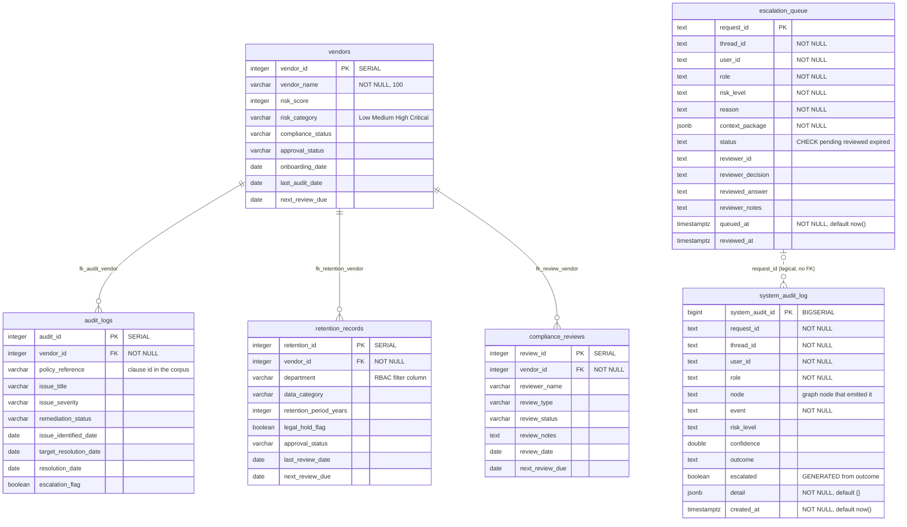
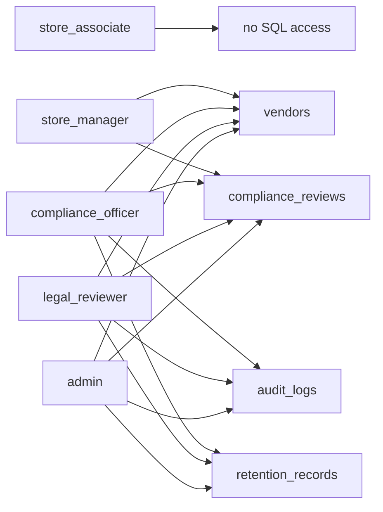

# Database Diagram

This document is the visual and conceptual companion to `data/sql/schema.sql`. The SQL file says *what* gets created; this file says *why it is shaped that way*, and what each table is doing inside the compliance agent.

The schema is deployed and browsable on Supabase:

| | |
|---|---|
| Project | `course-5-automation` |
| Project ref | `hmqnhkpczfcwnxhbcyas` |
| Region | `ap-south-1` (Mumbai) |
| Migration | `capstone_compliance_schema` |
| Live diagram | Supabase Dashboard → **Database** → **Schema Visualizer** |

---

## 1. The whole picture



---

## 2. Two islands, on purpose

The six tables are not one connected graph, and that is a design decision rather than an oversight.

**Island one — the compliance domain.** `vendors`, `audit_logs`, `retention_records` and `compliance_reviews` are the business records the agent reasons over. They form a clean star: `vendors` is the hub, the other three are spokes, every spoke carries a `NOT NULL vendor_id` foreign key back to the hub. This is the half of the database the NL2SQL path is allowed to touch.

**Island two — the agent's own trace.** `system_audit_log` and `escalation_queue` record what the agent did, not what the retailer's vendors did. They are keyed by `request_id` and `thread_id`, identifiers minted per API call, and they deliberately hold no foreign key into the domain island.

The separation matters because the two islands have opposite access rules. Domain tables are read by generated SQL under a role's grant. Trace tables are written by the framework and are never in any role's `include_tables` list, so no user question can ever reach them through the NL2SQL path — the isolation is structural, not a prompt instruction.

---

## 3. Table by table

### `vendors` — the hub

Every compliance question that mentions a company resolves to a row here first. Entity resolution does a fuzzy match on `vendor_name` before any other work happens, which is why the name column carries a trigram index rather than a plain B-tree.

`risk_category` is doing double duty. It describes the vendor, and it is also an RBAC boundary: a `store_manager` is scoped to `Low` and `Medium` only, so rows above that are stripped after execution. `next_review_due` is what the overdue-review probes compare against — and they compare against the pinned as-of date (2025-12-31), never against the database clock.

### `audit_logs` — findings against a vendor

One row per compliance issue raised. `policy_reference` is the bridge to the unstructured half of the system: it holds a clause identifier that also exists in the policy corpus, so a finding in the database can be joined by hand to the clause text that was breached. That join is not a SQL join — it happens in the hybrid path, where the SQL result and the retrieved clause are placed side by side for the validator.

`escalation_flag` and `remediation_status` are indexed together because the highest-value question in the whole dataset is "what is flagged and still open".

### `retention_records` — data retention obligations

The department-scoped table. `department` is what the executor filters on for `store_associate` and `store_manager` roles. That filtering happens *after* the query runs rather than inside it, so every row removed raises a `SQL_SANITY_FAILURE` defect that the answer has to disclose — a partial count is reported as a floor, never as a total.

`legal_hold_flag` is paired with `next_review_due` in one index because a record under legal hold is exempt from the normal retention clock, and the two are almost always read together.

### `compliance_reviews` — the review history

Append-in-practice history of who reviewed a vendor and what they concluded. Indexed on `(vendor_id, review_date DESC)` so "the latest review for this vendor" is an index-only lookup rather than a sort over the vendor's whole history.

### `system_audit_log` — the immutable trace

One row per node transition in the LangGraph run. Written from `src/core/audit.py` after every meaningful step, carrying the risk level and confidence score at that moment.

Two things make this table unusual:

`escalated` is a **generated stored column** — `outcome = 'escalated'` computed by Postgres at insert time. It is not something the application can set independently, so an escalation cannot be logged as anything other than an escalation.

Two **rewrite rules** make the table append-only:

```sql
CREATE RULE system_audit_no_update AS ON UPDATE TO system_audit_log DO INSTEAD NOTHING;
CREATE RULE system_audit_no_delete AS ON DELETE TO system_audit_log DO INSTEAD NOTHING;
```

`DO INSTEAD NOTHING` means an `UPDATE` or `DELETE` is silently discarded rather than raising an error. That is a slightly awkward contract — a caller gets no exception — but it is the right one for an audit trail. A compliance log that can be rewritten is not evidence, and enforcing that in the database means it holds regardless of which code path tries. Corrections are made by inserting a new row, not by editing an old one.

`detail` is `JSONB` because the payload differs per node: the guardrail node logs which check tripped, the SQL node logs the generated statement, the panel node logs the disagreement. Modelling that as columns would produce a table that is mostly `NULL`.

### `escalation_queue` — the human handoff

Where a request goes when the release gate refuses to certify it. `request_id` is the primary key rather than a surrogate integer, which makes the queue **naturally idempotent**: a retried escalation for the same request collides on the primary key instead of creating a duplicate review item.

`context_package` carries the whole review bundle as JSONB — the question, the draft the system would not release, validation defects, citations, SQL evidence, the reasoning trace. It lives in the row rather than being reassembled at review time, because the reviewer needs to see what the agent saw at the moment it gave up, not what the retrieval layer would return today.

The `status` CHECK constraint holds it to `pending`, `reviewed`, `expired`. Reviewer columns are nullable and stay `NULL` until a human acts.

---

## 4. Relationship cardinality

| Parent | Child | Constraint | Cardinality | Reading |
|---|---|---|---|---|
| `vendors` | `audit_logs` | `fk_audit_vendor` | 1 : 0..N | A vendor has any number of audit findings |
| `vendors` | `retention_records` | `fk_retention_vendor` | 1 : 0..N | A vendor has retention obligations per department and data category |
| `vendors` | `compliance_reviews` | `fk_review_vendor` | 1 : 0..N | A vendor accumulates a review history over time |
| `escalation_queue` | `system_audit_log` | none | 1 : 0..N, logical | Both carry `request_id`; correlated in analysis, not enforced |

All three foreign keys are plain references with no `ON DELETE` action, so the default `NO ACTION` applies — a vendor with any child row cannot be deleted. For a compliance dataset that is the behaviour you want. Cascading a vendor delete would take its audit findings with it, and an audit finding disappearing because someone tidied up a vendor record is exactly the failure the table exists to prevent.

---

## 5. Indexes and what each one is for

| Index | Table | Kind | Why it exists |
|---|---|---|---|
| `vendors_name_trgm_idx` | vendors | GIN, `gin_trgm_ops` on `lower(vendor_name)` | Fuzzy entity resolution. Users type "Acme Logistic" for "Acme Logistics Pvt Ltd". Trigram similarity survives typos and word-order drift; a B-tree does not |
| `vendors_risk_idx` | vendors | B-tree `(risk_category, compliance_status)` | The most common domain filter, and the RBAC risk boundary |
| `vendors_review_due_idx` | vendors | B-tree `(next_review_due)` | Range scans for overdue reviews against the pinned as-of date |
| `audit_logs_vendor_idx` | audit_logs | B-tree `(vendor_id)` | Foreign keys are not indexed automatically in Postgres; this is the join path |
| `audit_logs_escalation_idx` | audit_logs | B-tree `(escalation_flag, remediation_status)` | "Flagged and still open" — the highest-signal query in the dataset |
| `audit_logs_target_idx` | audit_logs | B-tree `(target_resolution_date)` | Breach-of-deadline probes |
| `retention_vendor_idx` | retention_records | B-tree `(vendor_id)` | Join path |
| `retention_department_idx` | retention_records | B-tree `(department)` | The RBAC department filter column |
| `retention_review_due_idx` | retention_records | B-tree `(next_review_due, legal_hold_flag)` | Overdue retention reviews, with the legal-hold exemption in the same index |
| `compliance_reviews_vendor_idx` | compliance_reviews | B-tree `(vendor_id, review_date DESC)` | "Latest review for this vendor" without a sort |
| `compliance_reviews_status_idx` | compliance_reviews | B-tree `(review_status)` | Open-review counts |
| `system_audit_request_idx` | system_audit_log | B-tree `(request_id)` | Replaying one request's full trace |
| `system_audit_escalated_idx` | system_audit_log | B-tree `(escalated, created_at DESC)` | Escalation-rate SLO reporting over a window |
| `escalation_queue_status_idx` | escalation_queue | B-tree `(status, queued_at)` | The reviewer console's work queue, oldest pending first |

The `DESC` in two of these is not decorative. An index declared ascending can be scanned backwards, but only cleanly for a single column — once a second column joins the ordering, matching the query's actual direction is what lets Postgres skip the sort entirely.

---

## 6. Extensions

| Extension | Version | Used by |
|---|---|---|
| `vector` | 0.8.2 | pgvector — the embedding column type and HNSW index on the policy knowledge base |
| `pg_trgm` | 1.6 | Trigram similarity behind `vendors_name_trgm_idx`, used by entity resolution |

---

## 7. The table that is not in schema.sql

`schema.sql` creates six tables. A running system has a seventh.

**`data_policy_kb`** is created by LlamaIndex's `PGVectorStore` the first time the corpus is ingested. The `data_` prefix is the library's own convention — `vector_table_name` in settings is `policy_kb`, and the store prefixes it. Its shape is owned by LlamaIndex, so putting it in the migration would mean two sources of truth for the same table:

| Column | Type | Holds |
|---|---|---|
| `id` | `bigserial` | Surrogate key |
| `node_id` | `varchar` | LlamaIndex node identifier |
| `text` | `varchar` | The chunk text |
| `metadata_` | `json` | `doc_type`, `clause_number`, `version`, `is_current`, `embed_model`, `file_hash`, `effective_date`, … |
| `embedding` | `vector(1536)` | Dense embedding, `text-embedding-3-small`, HNSW / cosine |

The application reaches into `metadata_` directly with `->>` for the things the vector store API does not expose — checking whether a clause number exists, detecting an embedding-model mismatch before it can poison retrieval, and marking superseded document versions `is_current = false`.

`schema.sql` also contains a conditional block that creates a `policy_kb_stats` view over that table — but only when the table already exists:

```sql
IF to_regclass('public.data_policy_kb') IS NOT NULL THEN ...
```

So on a fresh database the view is skipped, which is the case in the Supabase project right now. Re-running the schema after ingestion creates it. The view groups nodes by `doc_type`, `document_title`, `version`, `parsed_with` and `content_type` — it is the quickest way to answer "what is actually in the knowledge base, and which parser produced it".

---

## 8. How RBAC lands on this schema

Role grants are not stored in the database. They live in `src/auth/rbac.py` and are applied as `include_tables` on the `SQLDatabase` object, so a role that cannot see a table cannot generate SQL against it in the first place.



Two filters run on top of that grant, and both are enforced on the returned rows rather than in the generated SQL:

- **Department** — `store_associate` and `store_manager` see only their own department's `retention_records`
- **Risk category** — `store_manager` sees only `Low` and `Medium` `vendors`

Post-execution filtering is a known weakening compared with parameter-bound templates, and the system treats it as one. Every row removed increments `rows_filtered_by_scope`, which raises a sanity-check defect, which forces the narration to say the result is partial.

Neither `system_audit_log` nor `escalation_queue` appears in any role's grant. They are written by the framework and read by the reviewer console, never by a user's question.

---

## 9. Time is a literal, never a clock

Nothing in this schema defaults a business date to `now()`. The only `now()` defaults are on `system_audit_log.created_at` and `escalation_queue.queued_at`, which are wall-clock records of when the *system* acted.

Every business date — `next_review_due`, `target_resolution_date`, `last_audit_date` — is compared against a pinned as-of date of **2025-12-31**, supplied to the NL2SQL prompt as a literal. `validate_generated_sql` rejects any generated statement containing `CURRENT_DATE` or `NOW()`.

Two reasons. The seed rows are dated 2025, so reading the real clock would mark the entire dataset overdue and fire every risk probe High. And a compliance answer without a stated as-of date is not reproducible — re-running the same question next week would give a different answer with no record of why.

---

## 10. Applying this schema

**Locally**, against the Postgres in `DATABASE_URL`:

```bash
uv run python scripts/init_db.py
```

That applies `schema.sql` and then prints row counts for the four domain tables, so an empty table is visible immediately rather than at query time.

**On Supabase**, the same DDL is already applied as the `capstone_compliance_schema` migration. To point the application at it, set `DATABASE_URL` to the project's pooled connection string from **Project Settings → Database**, then run the dataset generator and the ingestion script:

```bash
uv run python generate_capstone_sql_data.py
uv run python scripts/ingest_policies.py
```

`ingest_policies.py` is what creates `data_policy_kb`. Re-running `init_db.py` after that also creates the `policy_kb_stats` view.

---

## 11. One thing to know before exposing this project

Supabase reports Row Level Security as **disabled on all six tables**. On a Supabase project the `anon` and `authenticated` roles are reachable from the internet with the publishable key, which means anyone holding that key can read or write every row.

This is fine while the project is a private capstone environment reached only through the backend's own connection string. It is not fine the moment a browser client gets the anon key.

Enabling RLS without policies blocks all access, including the backend's, so it is deliberately not applied here. When the time comes:

```sql
ALTER TABLE public.vendors ENABLE ROW LEVEL SECURITY;
ALTER TABLE public.audit_logs ENABLE ROW LEVEL SECURITY;
ALTER TABLE public.retention_records ENABLE ROW LEVEL SECURITY;
ALTER TABLE public.compliance_reviews ENABLE ROW LEVEL SECURITY;
ALTER TABLE public.system_audit_log ENABLE ROW LEVEL SECURITY;
ALTER TABLE public.escalation_queue ENABLE ROW LEVEL SECURITY;
```

Then add policies per table before anything client-side touches them. Note that the application's own RBAC is enforced in Python at the `include_tables` layer, so database policies would be a second, independent line of defence rather than a replacement for it.
