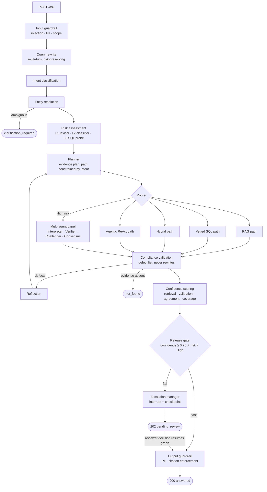

# Retail Policy Intelligence & Decision Support System

**An SLO-bound, agentic compliance question-answering platform for retail policy documents and operational records.**


The system answers questions such as *"Can we still share customer emails with Vertex Marketing Partners?"* by locating the governing policy clause, checking the live operational record, reconciling the two, and releasing an answer **only when it can be certified**. Anything it cannot certify is routed to a human reviewer — never hedged, never guessed.

---

## Table of contents

1. [Overview](#1-overview)
2. [Key capabilities](#2-key-capabilities)
3. [Architecture](#3-architecture)
4. [Technology stack](#4-technology-stack)
5. [Repository structure](#5-repository-structure)
6. [Getting started](#6-getting-started)
7. [Configuration](#7-configuration)
8. [API reference](#8-api-reference)
9. [Security & access control](#9-security--access-control)
10. [Reliability, SLOs & observability](#10-reliability-slos--observability)
11. [Cost & latency optimisation](#11-cost--latency-optimisation)
12. [Testing & evaluation](#12-testing--evaluation)
13. [Deployment](#13-deployment)
14. [Documentation](#14-documentation)
15. [Roadmap & known gaps](#15-roadmap--known-gaps)
16. [License](#16-license)

---

## 1. Overview

Compliance answers fail in a specific way: a fluent, well-cited response that quotes the policy and never checks the record. This platform is built around the opposite premise — **every answer must carry its evidence, and any answer whose evidence does not hold up is not released.**

Every request exits the system through exactly one of four terminal states:

| Outcome | HTTP | When | Caller receives |
|---|---|---|---|
| `answered` | `200` | Evidence verified, confidence ≥ threshold, risk not High | Answer, cited clauses, SQL executed, confidence, risk level, timings |
| `pending_review` | `202` | High risk, failed validation, low confidence, or unresolved conflict | `request_id` and poll URL — **no draft answer** |
| `refused` | `200` | Blocked by guardrail or out of scope | Reason |
| `clarification_required` | `200` | Entity could not be resolved | The question that must be answered first |

A question whose evidence genuinely does not contain the answer returns an honest `not_found` ("I don't know") rather than an escalation — a reviewer cannot certify an answer nobody can source.

---

## 2. Key capabilities

| Area | What is delivered |
|---|---|
| **Agentic orchestration** | LangGraph state machine with typed state, conditional routing, checkpointing and a bounded reflection cycle |
| **Five evidence paths** | RAG · vetted SQL · hybrid (parallel RAG + SQL, reconciled) · agentic ReAct · high-risk multi-agent panel |
| **Hybrid retrieval** | Dense (pgvector, HNSW) + BM25 lexical legs fused by Reciprocal Rank Fusion, FlashRank cross-encoder re-ranking |
| **Multimodal ingestion** | LlamaParse for layout-bearing PDFs/DOCX, geometric detection of *drawn* figures, vision captioning, clause-preserving chunking |
| **Safe SQL** | Catalogue of 17 reviewed, role-scoped templates selected via structured output; generated NL2SQL only as a guarded fallback tier |
| **Three-layer risk assessment** | L1 lexical floor → L2 constrained classifier → L3 SQL reality probe, fused by `max()` |
| **Validation & confidence** | Deterministic citation set-membership and SQL sanity checks, LLM-as-judge defect list, four-signal confidence score |
| **Human-in-the-loop** | LangGraph `interrupt_after` + checkpoint resume; reviewer decisions pass the same output guardrail as machine answers |
| **Multi-turn conversation** | Persisted threads, rolling summaries, risk-preserving query rewrite |
| **SLO enforcement** | Per-node wall-clock deadlines and token budgets in three tiers; P50/P95/P99 per stage and per path |
| **Cost controls** | Three-depth caching (semantic response / retrieval / LLM), heuristic small-vs-strong model routing, LiteLLM gateway, cost ledger |
| **Guardrails** | Prompt-injection screening, Presidio + Guardrails AI PII redaction, scope checks, SQL intent guard, citation enforcement |
| **External tools (MCP)** | Allow-listed DuckDuckGo MCP server for regulation cross-checks, output-clamped, graceful degradation |
| **Auditability** | Append-only audit log enforced at the database level, request-ID-correlated logs, Langfuse tracing |
| **Enterprise UI** | React 19 + TypeScript console: streaming chat, reviewer queue, SLO dashboard, corpus administration |

---

## 3. Architecture

### 3.1 Request lifecycle



### 3.2 Design principles

- **Risk does not choose the path; intent does.** Only `High` risk forces a path (the panel). Intent fixes the admissible set of paths and the planner may only choose inside it. Path selection is deterministic and logged.
- **The model proposes; the code disposes.** Every hard rule — High risk to the panel, role scoping, no wall-clock reads, cite only retrieved clauses — is enforced in code after the model returns. Prompts raise the base rate; code catches the residue.
- **Escalation is a node, not a return code.** Anything that cannot be released routes through `escalation_manager`, which writes a durable review-queue row before the graph checkpoints.
- **Degradation never bypasses escalation.** Under budget pressure the system produces a worse answer or no answer — never an uncertified one.
- **Retrieved text is data, never instruction.** Chunks are neutralised and delimited; MCP output is clamped.

### 3.3 Retrieval pipeline

```
scope filter (role ∩ requested scope, applied in the vector store)
   └─► dense leg (pgvector, HNSW, cosine)  ┐
   └─► lexical leg (BM25 over in-scope nodes) ┴─► Reciprocal Rank Fusion
                                                     └─► current-version / as-of filter
                                                           └─► FlashRank cross-encoder (optional tier)
```

### 3.4 Ingestion pipeline

```
router (LlamaParse vs LlamaIndex, decided from probe evidence, reason stamped on every node)
  └─► loaders (clean markdown)
        └─► extractors (clauses · tables · rasters · drawn figures — no model calls)
              └─► processors (semantic split → bounded recursive fallback; table summaries; vision captions)
                    └─► metadata contract (closed enums, single stamping point, validated before insert)
                          └─► pgvector insert → supersede previous versions
```

Ingestion is idempotent (file-hash), refuses embedding-model mismatches, and runs either as a blocking startup bootstrap on an empty index or via the admin `POST /ingest` endpoint.

---

## 4. Technology stack

| Layer | Technologies |
|---|---|
| **Runtime** | Python 3.12, `uv`, FastAPI, Uvicorn |
| **Orchestration** | LangGraph (typed state, conditional edges, `PostgresSaver` checkpointing, interrupts), LangChain structured output |
| **Knowledge layer** | LlamaIndex (`VectorStoreIndex`, `QueryFusionRetriever`, `BM25Retriever`, `SemanticSplitterNodeParser`, `ReActAgent`), LlamaParse |
| **Models** | Azure OpenAI — `gpt-4o` (strong tier), `gpt-4o-mini` (small tier), vision and embedding deployments; optional LiteLLM gateway |
| **Data** | PostgreSQL 17 with `pgvector` (HNSW) and `pg_trgm` |
| **Re-ranking** | FlashRank cross-encoder (local, no API call) |
| **Guardrails** | Guardrails AI (`DetectPII`), Microsoft Presidio, regex fallbacks |
| **Tools** | Model Context Protocol via `BasicMCPClient` / `McpToolSpec` (DuckDuckGo MCP server) |
| **Observability** | Langfuse tracing, structured request-scoped logging, Postgres-backed SLO metrics |
| **Auth** | Auth0 (JWT / JWKS validation, namespaced roles claim), RBAC scope tables |
| **Frontend** | Vite, React 19, TypeScript, `@auth0/auth0-react`, react-router, react-markdown |
| **Quality** | pytest (88 unit tests), golden-set evaluation runner, Ruff |

---

## 5. Repository structure

```
retail_capstone_project/
├── backend/            FastAPI + LangGraph service (see backend/README.md for the full engineering reference)
│   ├── configs/        settings, model tiering, database pool
│   ├── data/           policy corpus (data/policies/) and SQL schema/seed
│   ├── evals/          golden set and SLO-checking evaluation runner
│   ├── scripts/        init_db, ingest_policies, diagnose_ingestion, mcp_smoke
│   ├── src/
│   │   ├── api/        routes, escalation queue service
│   │   ├── auth/       JWT decoding, RBAC scope tables
│   │   ├── cache/      response / retrieval / LLM caches
│   │   ├── core/       budget guard, audit writer + circuit breaker, idempotency, SMTP handoff, conversation store
│   │   ├── graph/      typed state, graph builder, conditional-edge functions
│   │   ├── guardrails/ PII, injection, scope, SQL intent, output guard
│   │   ├── index/      LlamaIndex settings, model tiers, PGVectorStore
│   │   ├── ingestion/  router → loaders → extractors → processors → metadata → pipeline
│   │   ├── llm_routing/ complexity heuristics, routing strategies, cost ledger
│   │   ├── nodes/      one file per LangGraph node
│   │   ├── observability/ logging config, Langfuse callbacks, span timing
│   │   ├── prompts/    every system prompt
│   │   ├── retrieval/  fusion retriever, postprocessors, adapters
│   │   ├── schemas/    enums, domain models, API contracts
│   │   ├── sqlpath/    vetted template catalogue, selector, guarded NL2SQL engine
│   │   └── tools/      policy tool, SQL tool, MCP tools, role-scoped registry
│   ├── tests/
│   └── main.py
├── frontend/           React 19 + TypeScript enterprise console
├── swagger-docs/       API runbook and Swagger walkthroughs
└── render.yaml         Render deployment manifest
```

---

## 6. Getting started

### Prerequisites

- Python 3.12 and [`uv`](https://docs.astral.sh/uv/)
- PostgreSQL with the `vector` and `pg_trgm` extensions
- An Azure OpenAI resource with chat, vision-capable and embedding deployments
- A LlamaParse API key (only required for PDFs/DOCX containing tables or diagrams)
- Node.js 20+ for the frontend
- An Auth0 tenant (API audience + namespaced roles claim)

### Backend

```bash
cd backend
uv sync
cp .env.example .env            # fill in AZURE_OPENAI_*, DATABASE_URL, AUTH0_*

uv run python scripts/init_db.py                 # creates schema (domain tables, audit log, escalation queue)
uv run python generate_capstone_sql_data.py      # seeds operational data — run exactly once
uv run python scripts/init_db.py                 # verify row counts: 75 / 150 / 60 / 60

# place the policy corpus in data/policies/ — the first API start indexes it automatically
uv run python scripts/ingest_policies.py         # optional: index ahead of time and see node counts

uv run python main.py                            # http://localhost:8000  ·  Swagger at /docs
```

Optional Guardrails AI validators (the system falls back to Presidio + regex without them):

```bash
uv run guardrails configure
uv run guardrails hub install hub://guardrails/detect_pii
```

### Frontend

```bash
cd frontend
npm install
cp .env.example .env            # VITE_API_BASE_URL, VITE_AUTH0_DOMAIN, VITE_AUTH0_CLIENT_ID, VITE_AUTH0_AUDIENCE
npm run dev                     # http://localhost:5173
```

### Health check

```bash
curl -s localhost:8000/health | jq
# expects "database": "up", a non-null escalation_queue_depth, and audit_log.writing = true
```

---

## 7. Configuration

All settings are read from `.env` by `configs/settings.py`, which enforces minimum viable values and logs any field it had to raise. Key groups:

| Group | Examples | Notes |
|---|---|---|
| **Models** | `AZURE_OPENAI_*`, `MODEL_ROUTING_STRATEGY` (`heuristic` · `cost_saver` · `quality_first` · `static`), `LLM_GATEWAY_URL` | Small/strong tiering is applied per node class |
| **Deadlines & budgets** | `DEADLINE_SECONDS_STANDARD` / `_HYBRID` / `_AGENTIC` / `_HIGH_RISK`, `TOKEN_BUDGET` | Floors: 30 / 45 / 75 / 90 s, 16 000 tokens; shipped: 24 000 |
| **SLO targets** | `SLO_T1_P95_MS` … `SLO_T4_P95_MS`, `SLO_PATH_TARGET_RATIO` (0.85) | Each path is scored against its own target |
| **Retrieval** | `USE_AUTO_RETRIEVER`, `FUSION_NUM_QUERIES`, `RRF_K`, rerank flags | Auto-retriever off by default |
| **Caching** | TTLs and sizes per cache, `SEMANTIC_CACHE_THRESHOLD` (0.95) | Only certified answers are cached |
| **MCP** | `MCP_ENABLED`, `MCP_REQUIRED`, `MCP_SERVER_URL`, `MCP_ALLOWED_TOOLS`, `MCP_MAX_OUTPUT_CHARS` | Command form spawns the server over stdio |
| **Corpus** | `POLICY_CORPUS_DIR`, `BOOTSTRAP_CORPUS_ON_STARTUP`, `BOOTSTRAP_FAIL_FAST`, `AS_OF_DATE` | Set `BOOTSTRAP_FAIL_FAST=true` in production |
| **Auth** | `AUTH0_DOMAIN`, `AUTH0_AUDIENCE`, `AUTH0_ROLES_NAMESPACE` | Roles are read from the namespaced claim |

---

## 8. API reference

| Method | Endpoint | Role | Purpose |
|---|---|---|---|
| `GET` | `/health` | public | Database, audit-writer and queue status |
| `GET` | `/auth/me` | any | Identity and roles resolved from the bearer token |
| `POST` | `/auth/azure` | any | Supply Azure OpenAI credentials from the login screen (never stored in `.env`) |
| `POST` | `/ask` | any | Submit a question; returns one of the four terminal states |
| `GET` | `/requests/{request_id}` | any | Poll an escalated request |
| `GET` | `/review/queue` | reviewer | Pending escalations with full context packages |
| `GET` | `/review/{request_id}` | reviewer | One escalation package |
| `POST` | `/review/{request_id}` | reviewer | `accept` / `edit` / `reject` — resumes the checkpointed graph |
| `POST` | `/ingest` | admin | Upload one policy document |
| `GET` | `/ingest/status` | admin | Index state, embedding-model compatibility, per-document node counts |
| `POST` | `/ingest/rebuild?confirm=true` | admin | Re-index the corpus |
| `GET` | `/metrics/slo?hours=24` | reviewer | P50/P95/P99 per stage and per path, breached stages |
| `GET` | `/metrics/optimization` | reviewer | Cache hit rates and savings, routing share, spend per tier |
| `POST` | `/cache/invalidate?reason=…` | admin | Clear caches |

**Typical flow:** `POST /ask` → `202 pending_review` → reviewer `GET /review/queue` → `POST /review/{id}` → caller `GET /requests/{id}`.

Every `/ask` response includes `timings`, `trace.path_decision`, `trace.llm_usage` and the SQL evidence used, so a single call is self-explanatory without querying the metrics endpoints. Send `Idempotency-Key` to make retries safe and `X-Request-ID` to correlate them.

---

## 9. Security & access control

- **Authentication** — Auth0-issued JWTs validated against JWKS; roles are read from a namespaced claim.
- **RBAC** — five roles (`store_associate`, `store_manager`, `compliance_officer`, `legal_reviewer`, `admin`) mapped to document-type grants, table grants and endpoint permissions. Scope is enforced **inside the vector-store query** and in the SQL template catalogue — never as a prompt instruction.
- **SQL safety** — no free-form SQL on the primary path. The model selects a reviewed template and typed parameters via structured output; values are bound by `psycopg`. The generated fallback engine sits behind lexical and classifier intent guards, statement validation (`SELECT`/`WITH` only, no stacked statements, no `NOW()`/`CURRENT_DATE`), table-scope assertion, `statement_timeout` and a row cap. Row-level department scoping is applied and disclosed.
- **Input guardrails** — prompt-injection screening runs before PII redaction (so evidence of an attack is not mangled); PII is redacted before any embedding or model call.
- **Output guardrails** — Guardrails AI `DetectPII`, Presidio and regex scrub, then citation enforcement. The PII check **fails closed**: an error withholds the answer.
- **Injection surface via the corpus** — retrieved chunks are neutralised and wrapped as data; MCP tool output is allow-listed and clamped.
- **Human answers are not exempt** — reviewer-edited answers pass the same output guardrail as machine answers.
- **Idempotency** — per-user idempotency keys prevent duplicate escalations from client retries.

---

## 10. Reliability, SLOs & observability

### Budgets and deadlines
Every node runs under a wall-clock deadline and a token budget carried in graph state and checked **before** the node body executes:

| Tier | Nodes | Under pressure |
|---|---|---|
| Optional | reranker, thread summary, confidence calibration | Skipped; response marked `degraded` (−0.10 confidence) |
| Required | everything that gathers or judges evidence | Not run; request escalates with a named `budget_stop` |
| Release | output guardrail, escalation manager, refusal, clarification | Never budget-checked — the system must always be able to escalate |

Deadlines widen with the route (High risk and the agentic/hybrid paths), always computed from the original `started_ts`, so a late widening never restarts the clock.

### SLO reporting
Each node stamps a cumulative `t0–t4` mark. `GET /metrics/slo` computes P50/P95/P99 per stage via `percentile_cont`, scores each evidence path against its own target (`deadline × 0.85`), and names `breached_stages` and `breached_paths`. Requests that escalate early carry their last reached mark forward so percentiles are not computed over a shifting population.

### Auditability
- `system_audit_log` receives one row per node decision; `UPDATE`/`DELETE` are refused at the database level (`DO INSTEAD NOTHING` rules).
- An `AuditCircuit` breaker protects the request path from a slow database: after three consecutive failures audit writes are suspended for thirty seconds, the gap is logged with the number of lost rows, and `/health` reports it.
- Every log line, audit row, Langfuse trace and the `X-Request-ID` response header share one request id; parallel legs inherit it.
- Escalation reasons name the real cause (retries exhausted vs. time exhausted vs. tokens exhausted vs. retrieval no-match, including which documents were searched).

---

## 11. Cost & latency optimisation

| Mechanism | Detail |
|---|---|
| **Response cache** | Keyed on access scope + normalised question; **semantic** hits at cosine ≥ 0.95 using the index embedding model. Stores only certified answers (`answered`, above threshold, not degraded, no budget stop). Never shared across roles; never used for follow-ups with history. |
| **Retrieval cache** | Skips embedding, vector + BM25 search, fusion and re-ranking for repeated queries in the same scope (TTL 10 min). |
| **LLM cache** | TTL/LRU replacement for LangChain's global cache; temperature-0 calls only. |
| **Model routing** | Nodes are *fixed small* (rewrite, intent, risk, planner, selector, reflection), *fixed strong* (panel agents), or *routable* (generation, validation, agentic). Strategies: `heuristic` (default), `cost_saver`, `quality_first`, `static`. Routable nodes drop to the small tier under latency or token pressure — High-risk requests are exempt. |
| **Cost ledger** | Actual billed tokens priced per model; per-request in `trace.llm_usage`, process-wide on `/metrics/optimization`, soft ceiling per request. |
| **Gateway** | `LLM_GATEWAY_URL` routes both tiers through an OpenAI-compatible proxy (LiteLLM), so the small tier can be swapped for a local model without a code change. |

All decisions are recorded in the `/ask` trace (`model_route node=… tier=… reason=…`) and in the logs.

---

## 12. Testing & evaluation

```bash
cd backend
uv run pytest                                  # 88 unit tests — no database or model required
uv run python evals/run_eval.py                # 53-query golden set across all evidence paths
uv run python evals/run_eval.py --filter rl-   # record-lookup cases only
uv run python evals/run_eval.py --ci           # non-zero exit on an SLO breach (CI gate)
uv run ruff check .
```

Integration coverage includes graph routing against a fake chat model (proving small-tier handling of simple questions and strong-tier handling of complex ones), caching, model routing, request logging, and a live MCP test that skips when no server is reachable. Reviewer decisions are persisted alongside requests and form the labelled dataset for the escalation-precision objective.

---

## 13. Deployment

- **Render** — `render.yaml` provisions the backend as a native Python service (`uvicorn main:app --host 0.0.0.0 --port $PORT`). The DuckDuckGo MCP server runs in command form as a child process, so no second service is required.
- **Production settings** — set `BOOTSTRAP_FAIL_FAST=true` so a container without an indexed corpus refuses to become healthy; keep the shipped deadline and token floors; configure SMTP for reviewer notifications.
- **Database** — PostgreSQL with `vector` and `pg_trgm`; LangGraph checkpoint tables and the vector table are created by their owning libraries on first use.

---

## 14. Documentation

| Document | Contents |
|---|---|
| [`backend/README.md`](backend/README.md) | Full engineering reference — every design decision, defect history and the reasoning behind each subsystem |
| `backend/docs/AGENT_WORKFLOW.md` | Complete graph diagram and path decision table |
| `backend/docs/CAPSTONE_ALIGNMENT.md` | Mapping of deliverables to implementation |
| [`swagger-docs/`](swagger-docs/) | Swagger runbook and end-to-end walkthroughs (including the MCP cross-check demo) |
| `http://localhost:8000/docs` | Live OpenAPI / Swagger UI |

---

## 15. Roadmap & known gaps

- Extend the vetted SQL template catalogue to reduce reliance on the generated fallback tier.
- Move caches from process-local to a shared store for multi-instance deployments.
- Include LlamaIndex-originated calls (agentic path, generated SQL) in the cost ledger.
- Run the MCP server as a long-lived HTTP service to remove per-request spawn latency.
- Frontend: token streaming is currently rendered client-side over a single certified response.

---

## 16. License

[Specify license — e.g. MIT / Apache-2.0 — and add a `LICENSE` file at the repository root.]

---

<sub>Built as an end-to-end agentic AI capstone: FastAPI · LangGraph · LlamaIndex · Azure OpenAI · PostgreSQL/pgvector · React.</sub>