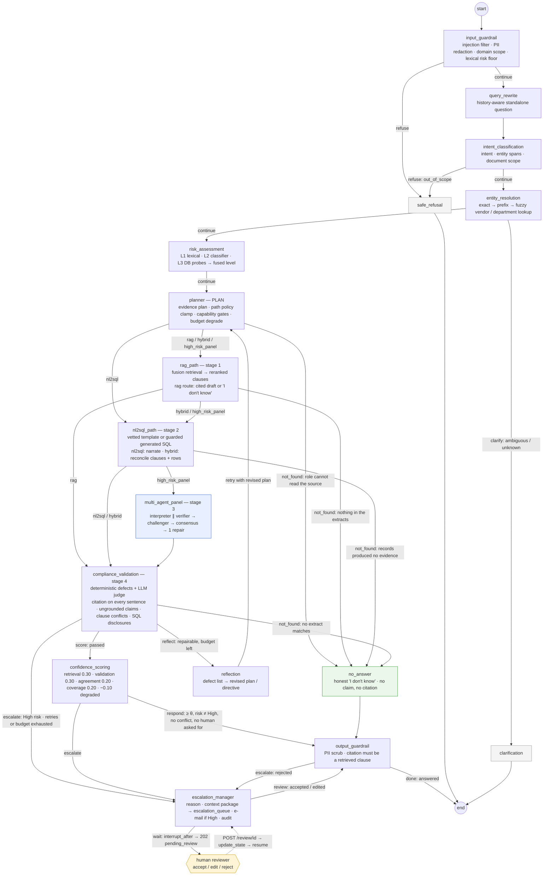

# Agent workflow — the policy graph (v4)

Capstone deliverable 2. This is the compiled LangGraph in `src/graph/builder.py`, drawn from
the code: every node, every conditional edge in `src/graph/routing.py`, and the interrupt that
hands a request to a human. The five agents the brief requires map onto it as follows.

| required agent | node(s) | model tier |
|---|---|---|
| Intent Classification Agent | `intent_classification` (plus `query_rewrite`, `entity_resolution`) | small |
| Retrieval Agent | `rag_path` (policy clauses), `nl2sql_path` (records; writes the reconciled hybrid answer) | routed: small / strong |
| Risk Assessment Agent | `risk_assessment` (L1 lexical, L2 classifier, L3 database probes, fused) | small |
| Compliance Validation Agent | `compliance_validation` (+ `reflection` for self-correction) | routed: small / strong |
| Escalation Manager Agent | `escalation_manager` (+ `output_guardrail`, `safe_refusal`, `clarification`, `no_answer`) | — |
| High-risk multi-agent panel | `multi_agent_panel`: policy interpreter ∥ data verifier → challenger → consensus → 1 repair | strong (fixed) |

## The evidence stages run in one fixed order

**RAG first, then NL2SQL, then the multi-agent panel, then compliance validation.** The planner
(the *Plan* in Plan–Reason–Act) picks the route; the route only decides which of the stages run.
A stage a route does not need is skipped, never re-ordered.

| route (planner) | stages, in order | who writes the answer |
|---|---|---|
| `rag` | `rag_path` → `compliance_validation` | `rag_path`, cited on every sentence an extract supports |
| `nl2sql` | `nl2sql_path` → `compliance_validation` | `nl2sql_path`, narrating the rows |
| `hybrid` | `rag_path` → `nl2sql_path` → `compliance_validation` | `nl2sql_path`, reconciling the clauses with the rows |
| `high_risk_panel` (risk = High, mandatory) | `rag_path` → `nl2sql_path` → `multi_agent_panel` → `compliance_validation` | the panel's consensus |

On the high-risk route a stage whose source the role cannot read is skipped (a role with no table
runs `rag_path` → `multi_agent_panel`). There is no agentic route in v4: no intent admits it, and a
planner that proposes it is clamped to the intent's default.



A budget stop at any node (the deadline or the token budget ran out) also goes to
`escalation_manager`; those edges are left out of the drawing to keep it readable.

## When a request goes to a human — and when it does not

**Escalates** (the brief's list, plus answers that cannot be certified):

| trigger | where |
|---|---|
| risk fused to High | `after_confidence`, and `after_validation` on a failed High-risk answer |
| conflicting clauses / policy vs record | `compliance_validation` → `after_validation`, at once (a repair cannot clear a conflict between the extracts) |
| panel could not reach consensus | `after_confidence` |
| confidence below θ (0.75) | `after_confidence` |
| an explicit request for a human or for legal validation ("I need legal validation", "can I talk to a compliance officer?", "escalate this to legal") — a question that only *mentions* the compliance officer, legal review or support is not one (`src/core/handoff.py`) | `after_confidence`, and every not-found edge |
| validation still failing after the permitted repairs, or no budget left for one | `after_validation` |
| output guardrail rejects the answer (unretrieved citation, PII check failed) | `after_output_guardrail` |
| a budget stop | every edge |

**Does not escalate — answers "I don't know" instead** (`no_answer`, released with HTTP 200 and
`not_found: true`):

| situation | `not_found_reason` |
|---|---|
| the best retrieved policy extract is a no-match | `no_match` |
| the RAG writer read the extracts and none of them answers the question (`answer_found = false`) | `not_in_extracts` |
| the records query produced no evidence on the nl2sql route | `no_records` |
| the only source that answers the question is outside the role's grant | `no_access` |

A human cannot certify an answer nobody can source, and a reviewer must not hand a role data it
may not read, so none of these is queued for review. High risk never takes this exit.

## Citations on a RAG answer

`rag_path` places the supporting clause on every claim — each sentence and each bullet line —
that a retrieved clause clearly supports (`cite_uncited_sentences` in `src/retrieval/citations.py`):
at least two shared content words, covering 40% of the claim, and more than any clause of another
extract; the writer's own cited clauses and a sub-clause heading only break ties. A clause is never
placed on a claim that says the opposite of it ("permitted" against a clause that prohibits) or
states a figure the clause does not hold. A claim no clause clearly supports is left bare and goes
back to the writer, rather than being given a guessed source. Markdown headings, table rows and
closing courtesy lines are not claims, and a marker written after a full stop belongs to that
sentence. A sentence that only says what the *evidence* does not cover ("the extracts do not
specify…") is never given a citation, and a sentence with obligation language (must, shall, may
not, prohibited…) is never treated as such a gap. `compliance_validation` then checks
deterministically that every claim of a RAG policy answer carries a citation that resolves to a
retrieved extract; when it does, the validator model's `missing_citation` on a cited sentence is
kept as a note, while a real `ungrounded_claim` (the clause does not say that) always blocks.

## Questions that must not be stopped before the stages

- A question the intent classifier calls `out_of_scope` is still answered as a policy question when
  the policy extracts clearly match it: best reranked extract ≥ 0.10, or just above the no-match
  ceiling (0.05) when the user narrowed it to a policy with the document chips. A creative-writing or
  "ignore the instructions" request is refused whatever it matches. A misspelt "what is the purpose
  of anti-brbrery?" used to be refused while the anti-bribery policy answers it.
- A category of records ("high risk vendors", "approved suppliers", "vendors with open findings") is
  a filter for the records query, not a vendor name, so it no longer stops the question with a
  clarification (`entity_resolution.is_description`).

## Cross-cutting behaviour (not drawn as nodes)

- **Budget guard** (`traced_node`): before every node, the remaining deadline and token budget
  are checked. Optional-tier nodes (reranker, thread summary) are skipped and the answer marked
  *degraded*; required nodes stop the run with a budget stop that the escalation manager names.
- **Budget degradation** is decided once, by the planner, and recorded in `routed_path`, so
  every stage reads the same route (hybrid under `HYBRID_MIN_SECONDS` degrades to the one
  source the intent turns on).
- **Model routing** (`src/llm_routing`): `rag_generate`, `hybrid_generate` and
  `compliance_validation` take the small or strong tier from the complexity assessment; the
  panel is always strong; classification calls are always small.
- **Caches** (`src/cache`): a certified answer for the same question in the same access scope is
  served before the graph starts; an identical retrieval reuses its chunk list; an identical
  prompt reuses its completion. All three are invalidated when the corpus changes.
- **Deadline follows the route**: `planner` and `risk_assessment` widen the deadline to the
  chosen route's budget (standard 30 s, hybrid 45 s, high-risk panel 90 s).
- **Every node** writes a trace span, a t1–t4 stage mark and an audit row; every decision edge
  logs `edge <from> -> <to> reason=…` under the request id, and the planner edge logs
  `evidence stages route=… order=rag_path -> nl2sql_path -> … -> compliance_validation`.

## Plan–Reason–Act with reflection

```
plan      planner                 → EvidencePlan (route, steps, required claims)
act       rag_path → nl2sql_path → multi_agent_panel   (the stages the route needs, in this order)
reason    compliance_validation   → defects, grounded-claim ratio, conflicts
reflect   reflection              → revised plan (or "not repairable" → escalate)
          ↳ back to planner, at most MAX_REFLECTION_RETRIES times (one for rag / nl2sql),
            only while the deadline and token budget still fund another pass
```

## Mandatory high-risk scenarios → where they are caught

| scenario (brief) | signal in this graph |
|---|---|
| cross-border transfer to a restricted jurisdiction | lexical trigger (`cross-border`, `jurisdiction`, `transfer`) → L1 floor; L2 scenario `vendor_data_sharing`; probes `vendor_high_risk_band`, `escalated_finding_present` |
| deletion request under active legal hold | L2 scenario `data_erasure`; probe `legal_hold_present`; SQL disclosure `legal_hold_flag` |
| approval override for a Critical-risk vendor | L2 `vendor_engagement`; probes `vendor_not_approved`, `vendor_high_risk_band`, `vendor_severe_open_finding` |
| hospitality / gift involving overseas suppliers | lexical triggers (`gift`, `hospitality`, `brib`, `overseas`) → High floor via scope rules |
| audit findings overdue beyond target date | L2 `audit_finding`; probe `vendor_overdue_remediation` |
| conflicting policy clauses across departments | `compliance_validation._clause_conflicts` → `CLAUSE_CONFLICT` defect → escalate |
| vendor onboarding with unresolved findings | L2 `vendor_engagement`; probe `vendor_severe_open_finding` |
| high-severity issue marked Closed without evidence | probes read `remediation_status <> 'Closed'`; the panel's data verifier lists what the data is silent on; SQL disclosure caveats |

A High fused level always runs `rag_path` → `nl2sql_path` → `multi_agent_panel` →
`compliance_validation`, recalculates confidence with the panel verdict, and ends at
`escalation_manager` — a High-risk answer is never released without a human.
