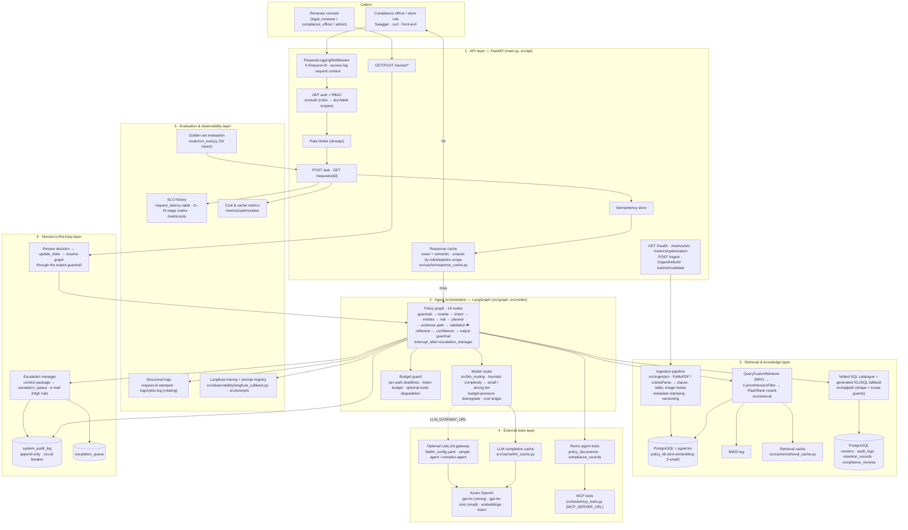

# Architecture — Retail Policy Intelligence & Decision Support System

Capstone deliverable 1. The six layers named in the brief, and where each one lives in this
repository. Renders on GitHub, in VS Code (Markdown Preview Mermaid) and in the Langfuse /
Swagger docs pages.

## Request lifecycle in one line per layer

1. **API** — the middleware mints (or accepts) `X-Request-ID`, JWT → role → document/table
   scopes, the idempotency store replays a duplicate, the response cache returns a certified
   answer for the same question in the same scope (exact or semantic), otherwise the graph runs.
2. **Orchestration** — LangGraph runs the Plan–Reason–Act loop with the budget guard in front of
   every node and the model router choosing the tier for the generation and validation calls.
3. **Knowledge** — the RAG leg fuses vector and BM25 hits, filters superseded versions and reranks
   (cached per query + scope); the records leg selects a vetted SQL template, or falls back to
   guarded generated SQL, against the four compliance tables.
4. **External tools** — Azure OpenAI directly or through a LiteLLM gateway; the completion cache
   short-circuits identical prompts; MCP tools are available to the ReAct agent on the agentic
   path.
5. **Observability** — every line carries the request id; Langfuse holds the trace and the
   prompts; `request_latency` feeds the SLO report; the ledger feeds the cost report; the
   golden set measures TSR, high-risk misclassification and per-path P95.
6. **Human-in-the-loop** — High risk, low confidence, conflicts, budget stops and explicit
   requests escalate with the full context package; a reviewer's decision resumes the paused
   graph so the released answer still passes the output guardrail.

## Data stores

| store | tables | purpose |
|---|---|---|
| PostgreSQL + pgvector | `policy_kb` | clause / table-summary / image-caption nodes with version metadata |
| PostgreSQL | `vendors`, `audit_logs`, `retention_records`, `compliance_reviews` | structured compliance records (synthetic) |
| PostgreSQL | `system_audit_log`, `escalation_queue`, `request_latency`, `conversation_turns`, `conversation_threads` | audit trail, human review queue, SLO history, multi-turn memory |
| PostgreSQL (LangGraph) | checkpoint tables | graph state per thread, so a review can resume the run |
| process memory | response / retrieval / LLM caches, idempotency store, cost ledger | cost and latency optimisation (see README §18) |
